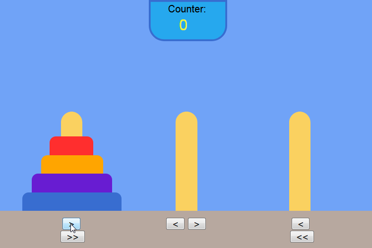
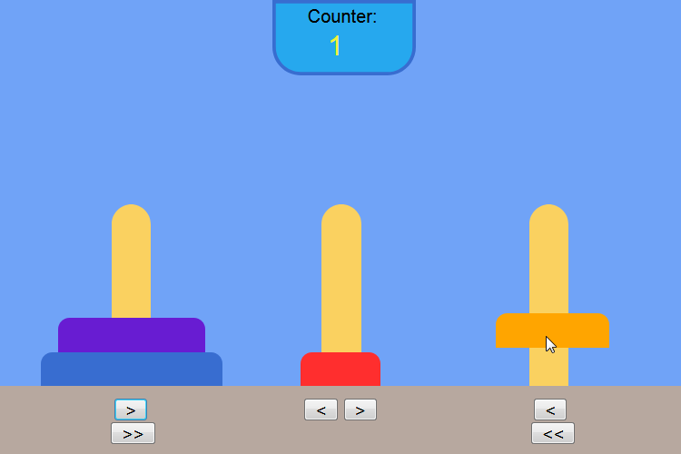
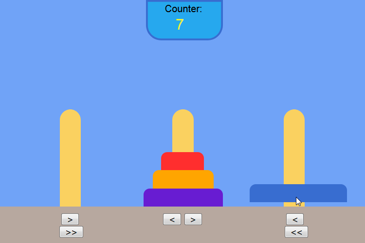
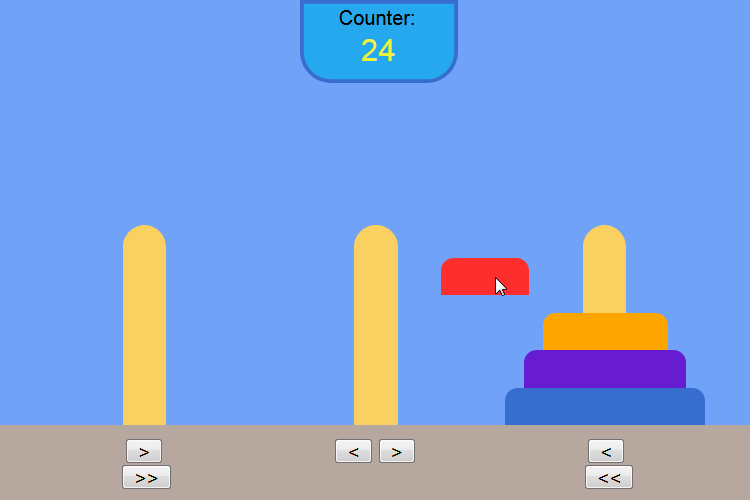
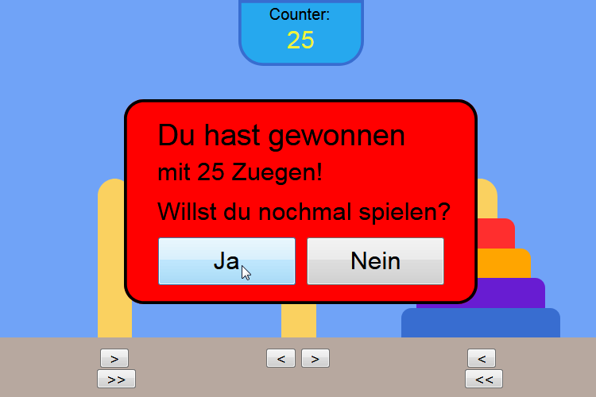

# [⛩ Tower of Hanoi JavaScript 🏯](https://ayidouble.github.io/Tower-of-Hanoi-JavaScript/)
⛩ **Tower of Hanoi**, a mathematical game. Realized with **draggable** HTML Elements and Buttons 🏯

The **Disks** are **draggable**, they can either be moved per **Drag & Drop** or with the **Buttons**.

## 🖼 Images 🖼

